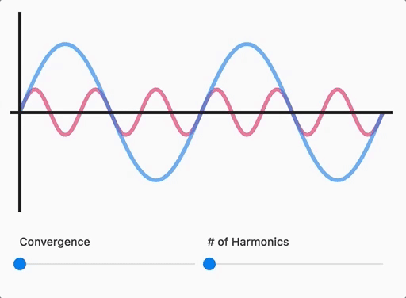

# Waveforms

This interactive guide introduces and explores waveforms. It covers how to read waveform graphs, goes over the fundamental physics of sound, teaches how it relates to music and harmony, and demonstrates how to build complex tones from simple ones.

This guide is aimed at a general audience–no prior knowledge is required.

[**Check it out!**](https://waveforms.surge.sh)

---

### Future plans

I'm toying with the idea of making this a series. There are other interesting audio concepts to explore. Off the top of my head:

* FFT
* Human perception of sound
* Phase offset effects like phasers, flangers, delays, and reverb
* Distortion (clip distortion, bit reduction)
* FM/AM synthesis
* Envelope generators and filters.

It's likely I won't get to this anytime soon, but do let me know if you think there's a need for interactive explanations of these concepts!

### How It's Made

This tutorial-thingy is purely front-end, built with React. No state management library was needed. Styled with `styled-components`.

The waveforms are rendered with SVG (although they can also render to Canvas with the change of a prop), and the air molecule grids render to Canvas. I used the fancy new IntersectionObserver to handle the scroll-based logic, with a fallback to a simple scroll listener.

> NOTE: This was a very interesting project from a technical perspective! I needed to draw Waveforms in lots of different configurations and states. Waveforms can be one of a series of predefined shapes, or arbitrary shapes (as is the case when converging multiple waveforms together). Waveforms can be "playing", and any state change that can happen (even changing the waveform shape) needs to work whether it's staying still or playing. Also, every transition should use spring physics. Also, it should be performant while doing all of this.
>
> I started writing up how it works, but I realized that it is super non-trivial, and it deserves a proper blog post. I would like to write that blog post at some point. If this interests you, feel free to [poke me on Twitter](https://twitter.com/JoshWComeau) and remind me.
>
> You can also poke around yourself! Check out all the components that start with `Waveform`, like `WaveformPlayer` or `WaveformTween`.

### Running locally

Want to run this on your machine? it _should_ be as simple as `git clone`, `yarn install`, and `yarn:start`. Let me know if that fails.

### Contributing

Please open issues describing changes you'd like to contribute before spending any time working on them; this is a personal side-project, and I open-sourced it primarily as an educational thing, for those curious how it was built. I'm not actively seeking external contributions, and there would be a bit of friction (this repo is no longer the "source of truth" for the project, as it lives on The Pudding).
2023-06-11 - Commit 0
2023-06-11 - Commit 1
2023-06-11 - Commit 2
2023-06-11 - Commit 3
2023-06-13 - Commit 0
2023-06-13 - Commit 1
2023-06-14 - Commit 0
2023-06-15 - Commit 0
2023-06-15 - Commit 1
2023-06-15 - Commit 2
2023-06-15 - Commit 3
2023-06-16 - Commit 0
2023-06-16 - Commit 1
2023-06-17 - Commit 0
2023-06-18 - Commit 0
2023-06-18 - Commit 1
2023-06-18 - Commit 2
2023-06-19 - Commit 0
2023-06-19 - Commit 1
2023-06-19 - Commit 2
2023-06-19 - Commit 3
2023-06-20 - Commit 0
2023-06-20 - Commit 1
2023-06-20 - Commit 2
2023-06-21 - Commit 0
2023-06-21 - Commit 1
2023-06-22 - Commit 0
2023-06-22 - Commit 1
2023-06-22 - Commit 2
2023-06-22 - Commit 3
2023-06-23 - Commit 0
2023-06-23 - Commit 1
2023-06-23 - Commit 2
2023-06-24 - Commit 0
2023-06-24 - Commit 1
2023-06-25 - Commit 0
2023-06-25 - Commit 1
2023-06-27 - Commit 0
2023-06-27 - Commit 1
2023-06-27 - Commit 2
2023-06-27 - Commit 3
2023-06-28 - Commit 0
2023-06-28 - Commit 1
2023-06-28 - Commit 2
2023-06-29 - Commit 0
2023-06-29 - Commit 1
2023-06-29 - Commit 2
2023-06-29 - Commit 3
2023-07-02 - Commit 0
2023-07-02 - Commit 1
2023-07-04 - Commit 0
2023-07-05 - Commit 0
2023-07-05 - Commit 1
2023-07-05 - Commit 2
2023-07-05 - Commit 3
2023-07-06 - Commit 0
2023-07-06 - Commit 1
2023-07-06 - Commit 2
2023-07-07 - Commit 0
2023-07-07 - Commit 1
2023-07-08 - Commit 0
2023-07-08 - Commit 1
2023-07-09 - Commit 0
2023-07-09 - Commit 1
2023-07-09 - Commit 2
2023-07-09 - Commit 3
2023-07-11 - Commit 0
2023-07-11 - Commit 1
2023-07-11 - Commit 2
2023-07-11 - Commit 3
2023-07-12 - Commit 0
2023-07-12 - Commit 1
2023-07-12 - Commit 2
2023-07-13 - Commit 0
2023-07-14 - Commit 0
2023-07-15 - Commit 0
2023-07-15 - Commit 1
2023-07-15 - Commit 2
2023-07-15 - Commit 3
2023-07-16 - Commit 0
2023-07-17 - Commit 0
2023-07-18 - Commit 0
2023-07-18 - Commit 1
2023-07-19 - Commit 0
2023-07-19 - Commit 1
2023-07-19 - Commit 2
2023-07-19 - Commit 3
2023-07-20 - Commit 0
2023-07-20 - Commit 1
2023-07-20 - Commit 2
2023-07-21 - Commit 0
2023-07-21 - Commit 1
2023-07-21 - Commit 2
2023-07-21 - Commit 3
2023-07-22 - Commit 0
2023-07-22 - Commit 1
2023-07-23 - Commit 0
2023-07-23 - Commit 1
2023-07-23 - Commit 2
2023-07-23 - Commit 3
2023-07-24 - Commit 0
2023-07-24 - Commit 1
2023-07-24 - Commit 2
2023-07-24 - Commit 3
2023-07-25 - Commit 0
2023-07-25 - Commit 1
2023-07-25 - Commit 2
2023-07-27 - Commit 0
2023-07-29 - Commit 0
2023-07-29 - Commit 1
2023-08-01 - Commit 0
2023-08-01 - Commit 1
2023-08-01 - Commit 2
2023-08-01 - Commit 3
2023-08-02 - Commit 0
2023-08-03 - Commit 0
2023-08-03 - Commit 1
2023-08-03 - Commit 2
2023-08-05 - Commit 0
2023-08-05 - Commit 1
2023-08-05 - Commit 2
2023-08-05 - Commit 3
2023-08-06 - Commit 0
2023-08-06 - Commit 1
2023-08-06 - Commit 2
2023-08-06 - Commit 3
2023-08-07 - Commit 0
2023-08-07 - Commit 1
2023-08-07 - Commit 2
2023-08-09 - Commit 0
2023-08-09 - Commit 1
2023-08-10 - Commit 0
2023-08-11 - Commit 0
2023-08-11 - Commit 1
2023-08-11 - Commit 2
2023-08-12 - Commit 0
2023-08-12 - Commit 1
2023-08-12 - Commit 2
2023-08-13 - Commit 0
2023-08-13 - Commit 1
2023-08-13 - Commit 2
2023-08-13 - Commit 3
2023-08-14 - Commit 0
2023-08-14 - Commit 1
2023-08-14 - Commit 2
2023-08-15 - Commit 0
2023-08-15 - Commit 1
2023-08-15 - Commit 2
2023-08-15 - Commit 3
2023-08-16 - Commit 0
2023-08-18 - Commit 0
2023-08-18 - Commit 1
2023-08-18 - Commit 2
2023-08-18 - Commit 3
2023-08-19 - Commit 0
2023-08-19 - Commit 1
2023-08-20 - Commit 0
2023-08-20 - Commit 1
2023-08-20 - Commit 2
2023-08-21 - Commit 0
2023-08-21 - Commit 1
2023-08-21 - Commit 2
2023-08-22 - Commit 0
2023-08-22 - Commit 1
2023-08-22 - Commit 2
2023-08-22 - Commit 3
2023-08-26 - Commit 0
2023-08-27 - Commit 0
2023-08-27 - Commit 1
2023-08-27 - Commit 2
2023-08-28 - Commit 0
2023-08-29 - Commit 0
2023-08-29 - Commit 1
2023-08-29 - Commit 2
2023-08-29 - Commit 3
2023-08-31 - Commit 0
2023-08-31 - Commit 1
2023-08-31 - Commit 2
2023-09-01 - Commit 0
2023-09-01 - Commit 1
2023-09-02 - Commit 0
2023-09-03 - Commit 0
2023-09-03 - Commit 1
2023-09-03 - Commit 2
2023-09-03 - Commit 3
2023-09-04 - Commit 0
2023-09-04 - Commit 1
2023-09-04 - Commit 2
2023-09-04 - Commit 3
2023-09-05 - Commit 0
2023-09-07 - Commit 0
2023-09-08 - Commit 0
2023-09-08 - Commit 1
2023-09-08 - Commit 2
2023-09-08 - Commit 3
2023-09-09 - Commit 0
2023-09-09 - Commit 1
2023-09-10 - Commit 0
2023-09-10 - Commit 1
2023-09-10 - Commit 2
2023-09-10 - Commit 3
2023-09-12 - Commit 0
2023-09-15 - Commit 0
2023-09-15 - Commit 1
2023-09-15 - Commit 2
2023-09-16 - Commit 0
2023-09-16 - Commit 1
2023-09-17 - Commit 0
2023-09-17 - Commit 1
2023-09-17 - Commit 2
2023-09-17 - Commit 3
2023-09-18 - Commit 0
2023-09-19 - Commit 0
2023-09-19 - Commit 1
2023-09-19 - Commit 2
2023-09-19 - Commit 3
2023-09-20 - Commit 0
2023-09-20 - Commit 1
2023-09-20 - Commit 2
2023-09-20 - Commit 3
2023-09-21 - Commit 0
2023-09-21 - Commit 1
2023-09-21 - Commit 2
2023-09-22 - Commit 0
2023-09-22 - Commit 1
2023-09-22 - Commit 2
2023-09-22 - Commit 3
2023-09-23 - Commit 0
2023-09-23 - Commit 1
2023-09-23 - Commit 2
2023-09-23 - Commit 3
2023-09-25 - Commit 0
2023-09-25 - Commit 1
2023-09-25 - Commit 2
2023-09-26 - Commit 0
2023-09-26 - Commit 1
2023-09-26 - Commit 2
2023-09-26 - Commit 3
2023-09-28 - Commit 0
2023-09-28 - Commit 1
2023-09-29 - Commit 0
2023-09-30 - Commit 0
2023-09-30 - Commit 1
2023-09-30 - Commit 2
2023-10-02 - Commit 0
2023-10-02 - Commit 1
2023-10-02 - Commit 2
2023-10-03 - Commit 0
2023-10-04 - Commit 0
2023-10-04 - Commit 1
2023-10-07 - Commit 0
2023-10-07 - Commit 1
2023-10-08 - Commit 0
2023-10-08 - Commit 1
2023-10-11 - Commit 0
2023-10-11 - Commit 1
2023-10-11 - Commit 2
